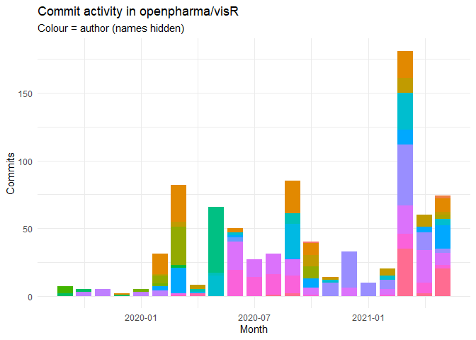
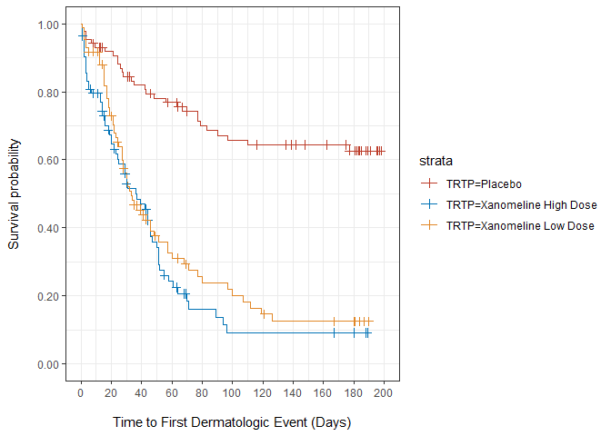

<!-- README.md is generated from README.Rmd. Please edit that file -->

# visR 

The goal of visR is to enable fit-for-purpose, reusable clinical and
medical research focused visualizations and tables with sensible
defaults and based on sound [graphical
principles](https://graphicsprinciples.github.io/).

[Package documentation](https://openpharma.github.io/visR/)

## Motivation

By using a common package for visualising data analysis results in the
clinical development process, we want to have a **positive influence**
on

  - **choice of visualisation** by making it easy explore different
    visualisation and to use impactful visualisations fit-for-purpose
  - effective visual communication by making it easy to **implement best
    practices**

We are not judging on what visualisation you chose for your research
question, but want facilitate and support good practice.

You can read more about the philosophy and architecture in the [repo
wiki](https://github.com/openpharma/visR/wiki).

## Lifecycle and status

The package is still experimental and under active development with a
current focus on developing a stable API.

<!-- badges: start -->

| Badge                                                                                                                                                                                         | Description                                                                  |
| --------------------------------------------------------------------------------------------------------------------------------------------------------------------------------------------- | ---------------------------------------------------------------------------- |
| [](https://www.tidyverse.org/lifecycle/#experimental)                                               | Development stage                                                            |
| [](https://codecov.io/gh/openpharma/visR?branch=develop)                                        | Unit testing coverage - currently points at `develop`                        |
| [](https://github.com/openpharma/visR/actions/workflows/check-standard.yaml) | `develop` branch                                                             |
| [](https://github.com/openpharma/visR/actions/workflows/check-standard.yaml)  | `master` branch                                                              |
| [](https://github.com/openpharma/visR/actions/workflows/makedocs.yml)                                  | Documentation building to [Github pages](https://openpharma.github.io/visR/) |

<!-- badges: end -->

## Installation

Install the development version from [GitHub](https://github.com/) with:

``` r
devtools::install_github("openpharma/visR")
```

## Example

This is a basic example to demonstrate how the API can be used to add
layers to a visualisation. In this example a time to event analysis. The
example calculates stratified Kaplan-Meier by treatment and then plots.
Additional functions can be used to add uncertainty intervals, censoring
information and a risk table.

``` r
library(visR)
library(survival)
library(dplyr)
library(tidyr) 
library(ggplot2)

# Need to add working example!

# adtte %>%
#   vr_KM_est(strata = "TRTP", conf.int = 0.90) %>%
#   vr_plot(legend_position = "right", x_unit = "Days") %>%
#   add_CI(style = "ribbon",
#          linetype = 3) %>%
#   add_CNSR(shape = 3, size = 1) %>%
#   add_risktable(
#     min_at_risk = 3,
#     statlist = c("n.risk", "n.event", "n.censor"),
#     label = c("At risk", "Event", "Censor"),
#     collapse = F
#   )
```

## Contribution

Please note that the ‘visR’ project is released with a [Contributor Code
of Conduct](CODE_OF_CONDUCT.md). By contributing to this project, you
agree to abide by its terms.

### Code contributors

| author                                                                                                               | commits\_all | commits\_6months | company          | location            | blog                                                     |
| :------------------------------------------------------------------------------------------------------------------- | -----------: | ---------------: | :--------------- | :------------------ | :------------------------------------------------------- |
|  rebecca-albrecht                 |           54 |               54 | NA               | NA                  |                                                          |
|  Mark Baillie(bailliem)           |          109 |               40 | NA               | Basel, CH           | <a href="https://graphicsprinciples.github.io/">link</a> |
|  Steven Haesendonckx(SHAESEN2)    |          136 |               28 | NA               | NA                  |                                                          |
|  Jonnie-Bevan                     |           25 |               25 | NA               | NA                  |                                                          |
|  James Black(epijim)               |           79 |               13 | Roche            | Basel, Switzerland  | <a href="www.epijim.uk">link</a>                         |
|  Charlotta(cschaerfe)              |           22 |               10 | NA               | NA                  |                                                          |
|  Tim Treis(dazim)                 |            3 |                1 | NA               | Heidelberg, Germany |                                                          |
|  Adam Foryś(galachad)              |            1 |                1 | @Roche           | Warsaw, Poland      | <a href="http://temote.pl">link</a>                      |
|  Diego S(diego-s)                  |           12 |               NA | NA               | NA                  |                                                          |
|  ginberg                           |            1 |               NA | NA               | Remote              | <a href="gerinberg.com">link</a>                         |
|  kawap                            |            2 |               NA | Roche / 7N       | NA                  |                                                          |
|  Matt Kent(kentm4)                |            3 |               NA | Genesis Research | NA                  |                                                          |
|  thanos-siadimas                  |            1 |               NA | NA               | NA                  |                                                          |
|  Thomas Neitmann(thomas-neitmann) |            2 |               NA | Roche            | Basel, Switzerland  | <a href="https://thomasadventure.blog/">link</a>         |

### Code activity



## Function activity

``` r
lines <- local_repo %>%
  unnest_log() %>%
  set_changed_file_to_latest_name() %>%
  add_line_history()
#> The following name changes were identified (34 in total):
#> ● R/{pvr_cross_tab.R => vr_cross_tab.R}
#> ● R/{pvr_attrition.R => vr_plt_attrition.R}
#> ● R/{pvr_stacked_barchart.R => vr_stacked_barchart.R}
#> ● R/{vr_plt_attrition.R => vr_attrition.R}
#> ● R/{vr_kaplan_meier.R => vr_est_kaplan_meier.R}
#> ● man/{pvr_attrition.Rd => vr_attrition.Rd}
#> ● R/{vr_plot_forest.R => vr_plt_forest.R}
#> ● man/{vr_plot_forest.Rd => vr_plt_forest.Rd}
#> ● R/{vr_KM_risktable.R => add_KM_risktable.R}
#> ● R/{add_KM_CI.R => add_CI.R}
#> ● R/{add_KM_risktable.R => add_risktable.R}
#> ● R/{vr_KM_plot.R => vr_plot.R}
#> ● {R => examples}/example.R
#> ● {R => examples}/example_api.R
#> ● {R => examples}/example_vignette_recreation.R
#> ● R/{add_COX_HR.R => get_COX_HR.R}
#> ● examples/CDISC SDTM ADaM Pilot Project m5toc.pdf => CDISC SDTM ADaM Pilot Project m5toc.pdf
#> ● .github/workflows/{r_cmd_check-MasterDevelop.yml => R-CMD-check.yml}
#> ● .github/workflows/{CI_CD.yaml => CI-CD.yaml}
#> ● docs/articles/Example_analysis_files/figure-html/{unnamed-chunk-4-1.png => unnamed-chunk-5-1.png}
#> ● R/{vr_KM_est.R => estimate_KM.R}
#> ● man/{vr_KM_est.Rd => estimate_KM.Rd}
#> ● R/{vr_create_risktable.R => get_risktable.R}
#> ● R/{vr_render_table.R => render_table.R}
#> ● R/{render_table.R => render.R}
#> ● R/{vr_plot.R => plot.R}
#> ● R/{vr_utils.R => utils.R}
#> ● R/{vr_create_tableone.R => create_tableone.R}
#> ● R/{vr_table_one.R => table_one.R}
#> ● R/{create_tableone.R => get_tableone.R}
#> ● R/{table_one.R => tableone.R}
#> ● vignettes/{Example_analysis.Rmd => Example_analysis2.Rmd}
#> ● vignettes/{Example_analysis2.Rmd => Example_analysis.Rmd}
#> ● .github/workflows/{docs => makedocs.yml}

r_files <- grep("^R/", lines$changed_file, value = TRUE)

to_plot <- lines %>%
  filter(changed_file %in% r_files) %>%
  add_n_times_changed_file() %>%
  filter(n_times_changed_file >= 10)
ggplot(to_plot, aes(x = date, y = current_lines)) + 
  geom_step() + 
  scale_y_continuous(name = "Number of Lines", limits = c(0, NA)) + 
  facet_wrap(~changed_file, scales = "free_y", ncol = 4) +
  ggthemes::theme_hc()
```



## Code coverage

Last time readme built.

``` r
covr::package_coverage()
#> visR Coverage: 3.97%
#> R/add_annotation.R: 0.00%
#> R/add_CI.R: 0.00%
#> R/add_CNSR.R: 0.00%
#> R/add_risktable.R: 0.00%
#> R/get_COX_HR.R: 0.00%
#> R/get_pvalue.R: 0.00%
#> R/get_quantile.R: 0.00%
#> R/get_risktable.R: 0.00%
#> R/get_summary.R: 0.00%
#> R/get_tableone.R: 0.00%
#> R/plot.R: 0.00%
#> R/render.R: 0.00%
#> R/style_visR.R: 0.00%
#> R/tableone.R: 0.00%
#> R/tidyme.R: 0.00%
#> R/utils.R: 0.00%
#> R/vr_alluvial_plot.R: 0.00%
#> R/vr_alluvial_wrangling.R: 0.00%
#> R/vr_attrition_table.R: 0.00%
#> R/vr_attrition.R: 0.00%
#> R/vr_cross_tab.R: 0.00%
#> R/vr_plotly.R: 0.00%
#> R/vr_plt_forest.R: 0.00%
#> R/vr_stacked_barchart.R: 0.00%
#> R/vr_tidy_rbest.R: 0.00%
#> R/utilities.R: 8.82%
#> R/estimate_KM.R: 96.08%
```
