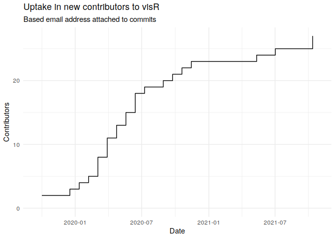
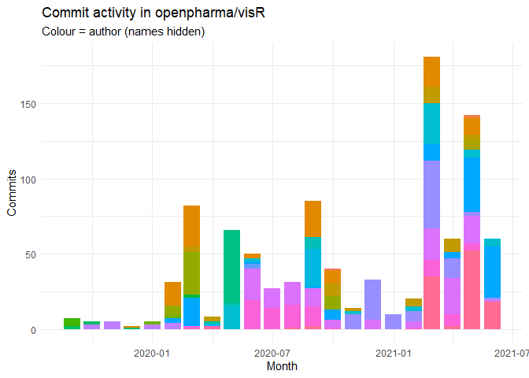

<!-- README.md is generated from README.Rmd as part of the CICD process. -->

<!-- Please edit README.Rmd - but you do not need to build it! -->

# visR 

The goal of visR is to enable fit-for-purpose, reusable clinical and
medical research focused visualizations and tables with sensible
defaults and based on sound [graphical
principles](https://graphicsprinciples.github.io/).

[Package documentation](https://openpharma.github.io/visR/)

## Motivation

By using a common package for visualising data analysis results in the
clinical development process, we want to have a **positive influence**
on

  - **choice of visualisation** by making it easy explore different
    visualisation and to use impactful visualisations fit-for-purpose
  - effective visual communication by making it easy to **implement best
    practices**

We are not judging on what visualisation you chose for your research
question, but want to facilitate and support good practice.

You can read more about the philosophy and architecture in the [repo
wiki](https://github.com/openpharma/visR/wiki).

## Lifecycle and status

The package is still experimental and under active development with a
current focus on developing a stable API.

<!-- badges: start -->

| Badge                                                                                                                                                                                      | Description                                                                  |
| ------------------------------------------------------------------------------------------------------------------------------------------------------------------------------------------ | ---------------------------------------------------------------------------- |
| [](https://lifecycle.r-lib.org/articles/stages.html#experimental)                                | Development stage                                                            |
| [](https://codecov.io/gh/openpharma/visR?branch=main)                                        | Unit testing coverage - on `main`                                            |
| [](https://github.com/openpharma/visR/actions/workflows/check-standard.yaml) | `main` branch                                                                |
| [](https://github.com/openpharma/visR/actions/workflows/makedocs.yml)                               | Documentation building to [Github pages](https://openpharma.github.io/visR/) |
| [](https://CRAN.R-project.org/package=visR)                                                                                       | Latest CRAN release                                                          |
| <a href=https://github.com/pharmaR/riskmetric></img></a>                                                                      | `riskmetric` score                                                           |

<!-- badges: end -->

## Installation

The easiest way to get `visR` is to install from CRAN:

``` r
install.packages("visR")
```

Install the *development* version from [GitHub](https://github.com/)
with:

``` r
# defaults to develop branch
devtools::install_github("openpharma/visR") 
```

Install the *latest stable* version from [GitHub](https://github.com/)
with:

``` r
devtools::install_github("openpharma/visR", ref = "main")
```

## Example

This is a basic example to demonstrate how the API can be used to add
layers to a visualization. In this example a time to event analysis. The
example calculates stratified Kaplan-Meier by treatment and then plots.
Additional functions can be used to add uncertainty intervals, censoring
information and a risk table.

``` r
library(visR)
library(ggplot2)

theme_set(theme_minimal())

adtte %>%
  estimate_KM(strata = "TRTP", conf.int = 0.90) %>%
  visr(legend_position = "right", x_unit = "Days") %>%
  add_CI(style = "ribbon") %>%
  add_CNSR(shape = 3, size = 1) %>%
  add_risktable(
    statlist = c("n.risk", "n.event", "n.censor"),
    label = c("At risk", "Event", "Censor")
  )
```


## Contribution

Please note that the `visR` project is released with a [Contributor Code
of Conduct](CODE_OF_CONDUCT.md). By contributing to this project, you
agree to abide by its terms.





## Code coverage

Last time readme built.

``` r
covr::package_coverage(
  type = "none", 
  code = "tools::testInstalledPackage(pkg = 'visR', types = c('tests'))", 
  quiet = FALSE
)
#> visR Coverage: 99.88%
#> R/visr.R: 99.12%
#> R/add_annotation.R: 100.00%
#> R/add_CI.R: 100.00%
#> R/add_CNSR.R: 100.00%
#> R/add_highlight.R: 100.00%
#> R/add_quantiles.R: 100.00%
#> R/add_risktable.R: 100.00%
#> R/apply_attrition.R: 100.00%
#> R/apply_theme.R: 100.00%
#> R/estimate_cuminc.R: 100.00%
#> R/estimate_KM.R: 100.00%
#> R/get_attrition.R: 100.00%
#> R/get_COX_HR.R: 100.00%
#> R/get_pvalue.R: 100.00%
#> R/get_quantile.R: 100.00%
#> R/get_risktable.R: 100.00%
#> R/get_summary.R: 100.00%
#> R/get_tableone.R: 100.00%
#> R/render.R: 100.00%
#> R/tableone.R: 100.00%
#> R/tidyme.R: 100.00%
#> R/utils_general.R: 100.00%
#> R/utils_pipe.R: 100.00%
#> R/utils_table.R: 100.00%
#> R/utils_visr.R: 100.00%
```
