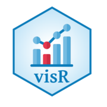
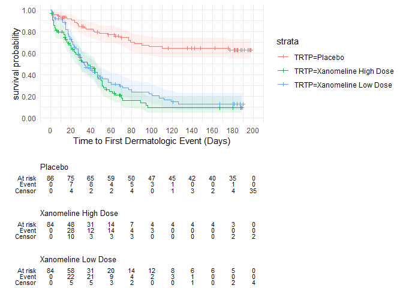
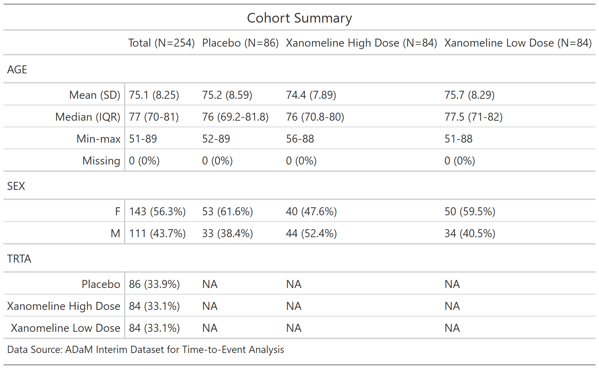

<!-- README.md is generated from README.Rmd as part of the CICD process. -->
<!-- Please edit README.Rmd - but you do not need to build it! -->

# visR 

<!-- badges: start -->

[](https://codecov.io/gh/openpharma/visR?branch=main)
[](https://github.com/openpharma/visR/actions)
[](https://github.com/openpharma/visR/actions/workflows/makedocs.yml)
[](https://CRAN.R-project.org/package=visR)
<a href=https://github.com/pharmaR/riskmetric></img></a>
<!-- badges: end -->

The goal of visR is to enable fit-for-purpose, reusable clinical and
medical research focused visualizations and tables with sensible
defaults and based on sound [graphical
principles](https://graphicsprinciples.github.io/).

[Package documentation](https://openpharma.github.io/visR/)

## Motivation

By using a common package for visualising data analysis results in the
clinical development process, we want to have a **positive influence**
on

-   **choice of visualisation** by making it easy explore different
    visualisation and to use impactful visualisations fit-for-purpose
-   effective visual communication by making it easy to **implement best
    practices**

We are not judging on what visualisation you chose for your research
question, but want to facilitate and support good practice.

You can read more about the philosophy and architecture in the [repo
wiki](https://github.com/openpharma/visR/wiki).

## Installation

The easiest way to get `visR` is to install from CRAN:

``` r
install.packages("visR")
```

Install the *development* version from [GitHub](https://github.com/)
with:

``` r
# defaults to develop branch
devtools::install_github("openpharma/visR") 
```

Install the *latest stable* version from [GitHub](https://github.com/)
with:

``` r
devtools::install_github("openpharma/visR", ref = "main")
```

## Examples

#### Visualization

This is a basic example to demonstrate how the API can be used to add
layers to a visualization. This example demonstrates a time-to-event
analysis. The example calculates and then plots stratified Kaplan-Meier
by treatment. It is possible to add uncertainty intervals, censoring
information, and a risk table using additional functions.

``` r
library(visR)
library(ggplot2)

theme_set(theme_minimal())

adtte %>%
  estimate_KM(strata = "TRTP", conf.int = 0.90) %>%
  visr(legend_position = "right", x_unit = "Days") %>%
  add_CI(style = "ribbon") %>%
  add_CNSR(shape = 3, size = 1) %>%
  add_risktable(
    statlist = c("n.risk", "n.event", "n.censor"),
    label = c("At risk", "Event", "Censor")
  )
```



#### Summary Table

The `tableone()` function presents summary statistics in a table format.

``` r
## table by treatment - without overall and render with GT
tableone <-
  adtte %>%
  dplyr::select(AGE, SEX, TRTA) %>%
  visR::tableone(
     strata = "TRTA",
     overall = TRUE,
     title = "Cohort Summary",
     datasource = "ADaM Interim Dataset for Time-to-Event Analysis",
     engine = "gt"
  )
```



## Cite visR

``` text
> citation("visR")
```

## Contributing

Please note that the `visR` project is released with a [Contributor Code
of Conduct](CODE_OF_CONDUCT.md). By contributing to this project, you
agree to abide by its terms. Thank you to all contributors:

[@AlexandraP-21](https://github.com/AlexandraP-21),
[@ardeeshany](https://github.com/ardeeshany),
[@bailliem](https://github.com/bailliem),
[@ddsjoberg](https://github.com/ddsjoberg),
[@epijim](https://github.com/epijim),
[@gdario](https://github.com/gdario),
[@joanacmbarros](https://github.com/joanacmbarros),
[@lcomm](https://github.com/lcomm),
[@prabhushanmup](https://github.com/prabhushanmup),
[@rebecca-albrecht](https://github.com/rebecca-albrecht),
[@SHAESEN2](https://github.com/SHAESEN2),
[@timtreis](https://github.com/timtreis),
[@cschaerfe](https://github.com/cschaerfe),
[@AlexandraP-21](https://github.com/AlexandraP-21)
