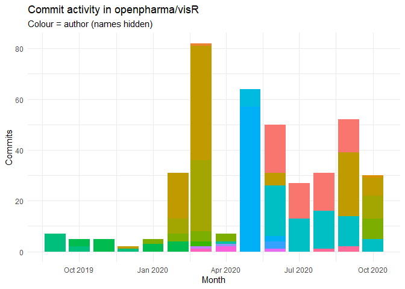

<!-- README.md is generated from README.Rmd. Please edit that file -->

# visR 

The goal of visR is to enable fit-for-purpose, reusable clinical and
medical research focused visualizations and tables with sensible
defaults and based on sound graphical principles.

[Package documentation](https://openpharma.github.io/visR/)

## Motivation

By using a common package for visualising data analysis results in the
clinical development process, we want to have a **positive influence**
on

  - **choice of visualisation** by making it easy explore different
    visualisation and to use impactful visualisations fit-for-purpose
  - effective visual communication by making it easy to **implement best
    practices**

We are not judging on what visualisation you chose for your research
question, but want facilitate to make you do your work as you need it\!

You can read more about the philosophy and architecture in the repo wiki

<!-- badges: start -->

| Badge                                                                                                                                                                           | Description                                                |
| ------------------------------------------------------------------------------------------------------------------------------------------------------------------------------- | ---------------------------------------------------------- |
| [](https://www.tidyverse.org/lifecycle/#experimental)                                 |                                                            |
|                                                                 | Develop                                                    |
|                                                                   | Master                                                     |
| [](https://github.com/openpharma/visR/actions) | R build status last active branch (exclude dev and master) |

<!-- badges: end -->

.

## Installation

Install the development version from [GitHub](https://github.com/) with:

``` r
# install.packages("devtools")
devtools::install_github("openpharma/visR")
```

## Example

This is a basic example which shows you how to solve a common problem:

TODO: add an example.

``` r
## library(visR)
## basic example code
```

Please note that the ‘visR’ project is released with a [Contributor Code
of Conduct](CODE_OF_CONDUCT.md). By contributing to this project, you
agree to abide by its terms.

## Code contributors

<a href="https://github.com/openpharma/visR/graphs/contributors">

</a>

    #> 
    #>      checking for file ‘/tmp/RtmplfMI5S/remotes55e720ee0183/lorenzwalthert-gitsum-bd98c22/DESCRIPTION’ ...  ✔  checking for file ‘/tmp/RtmplfMI5S/remotes55e720ee0183/lorenzwalthert-gitsum-bd98c22/DESCRIPTION’
    #>   ─  preparing ‘gitsum’:
    #>      checking DESCRIPTION meta-information ...  ✔  checking DESCRIPTION meta-information
    #>   ─  checking for LF line-endings in source and make files and shell scripts
    #>   ─  checking for empty or unneeded directories
    #>    Removed empty directory ‘gitsum/tests/testthat/test-dir/.gitsum’
    #>      Removed empty directory ‘gitsum/tests/testthat/test-dir’
    #>    Removed empty directory ‘gitsum/tests/testthat/test-dir-reports/.gitsum’
    #>    Removed empty directory ‘gitsum/tests/testthat/test-dir-reports’
    #> ─  looking to see if a ‘data/datalist’ file should be added
    #>   ─  building ‘gitsum_0.0.9001.tar.gz’
    #>      
    #> 


