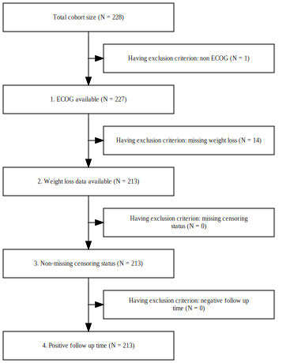

```{r, include = FALSE}
knitr::opts_chunk$set(
  collapse = TRUE,
  comment = "#>"
)
```

# Time to Event Analysis using visR

This short tutorial illustrates a typical use case in clinical development - the analysis of time to a certain event (e.g., death) in different populations. Typically, data obtained in randomized clinical trials (RCT) can be used to estimate the overall survival of patients in one group (e.g., treated with drug X) vs another group (e.g., treated with drug Y) and thus determine if there is a difference between these treatments.

For a more thorough introduction to Survival Analysis, we recommend the following tutorial: https://bioconnector.github.io/workshops/r-survival.html

In this example, we will work with patient data from NCCTG Lung Cancer dataset that is part of the `survival` package.

```{r installvisR, eval=FALSE}
#devtools::install_github("https://github.com/openpharma/visR.git")
```


```{r imports, echo=FALSE, warning=FALSE}
library(dplyr)
library(ggplot2)
library(survival)
library(visR)
```
# Global Document Setup
```{r globalSetup}
# Constants
DATASET <- paste0("NCCTG Lung Cancer Dataset (from survival package ", packageVersion("survival"), ")")

# Global visualisation settings
theme_set(theme_bw())
```


```{r initialCohort}
data(lung)

lung_cohort <- lung %>% 
  rename(ECOG = ph.ecog,
         Karnofsky = ph.karno,
         institution = inst
         ) %>% 
  mutate(patid = paste0("Pat", row_number()),
         institution = factor(institution),
         sex = factor(if_else(sex == 1, "male", "female")),
         ECOG = factor(case_when(ECOG == 0 ~ "0 asymptomatic",
                          ECOG == 1 ~ "1 ambulatory",
                          ECOG == 2 ~ "2 in bed less than 50% of day",
                          ECOG == 3 ~ "3 in bed more than 50% of day",
                          ECOG == 4 ~ "4 bedbound",
                          ECOG == 5 ~ "5 dead")),
         dx_age_group = factor(case_when(age < 30 ~ "< 30y",
                                         age >= 30 & age <= 50 ~ "30-50y",
                                         age > 50 & age <= 70 ~ "51-70y",
                                         age > 70 ~ "> 70y"),
                               levels=c("< 30y", "30-50y", "51-70y", "> 70y")),
    status = if_else(status == 1, 0, 1)) %>% 
    select(-meal.cal, -pat.karno)
```

# Cohort Selection
For this exercise we will only include patients with (1) ECOG available (2) and non-missing weight-loss data in our analysis

## Attrition Table
```{r attritionTable}
cohort_attrition <- vr_attrition_table(
  data = lung_cohort,
  criteria_descriptions = c("1. ECOG available", 
                            "2. Weight loss data available", 
                            "3. Non-missing vital status",
                            "4. Positive follow up time"),
  criteria_conditions   = c("!is.na(ECOG)",
                            "!is.na(wt.loss)",
                            "!is.na(status)",
                            "time >= 0"),
  subject_column_name   = 'patid'
)

cohort_attrition %>% 
  vr_render_table("Attrition Table", "Summary of samples fulfilling inclusion/exclusion criteria", DATASET, engine = "gt")

cohort_attrition %>% 
  vr_render_table("Attrition Table", "Summary of samples fulfilling inclusion/exclusion criteria", DATASET, engine = "dt",
                  download_format=c("csv", "excel"))

```


## Attrition Diagram
```{r attritionFig, include=FALSE}
figures_directory = "/tmp"

complement_descriptions <- c(                                                   
    "Having exclusion criterion: non ECOG",                                            
    "Having exclusion criterion: missing weight loss ",
    "Having exclusion criterion: missing vital status",
    "Having exclusion criterion: negative follow up time"
)

# Create attrition flowchart
attrition_flow <- vr_attrition(cohort_attrition$`Remaining N`, cohort_attrition$Criteria, complement_descriptions,
    output_path = "./attrition_diagram.svg")
```

```{r attritionFigShow, fig.cap=paste("Attrition Diagram of BRCA cohort. Data Source: ", DATASET), results='asis'}

```


Currently, the attrition code does not modify the actual dataset. We thus need to further implement the filtering to produce the analysis dataset
```{r}
lung_cohort <- lung_cohort %>% 
  filter(!is.na(ECOG),
         !is.na(wt.loss),
         !is.na(status),
         time >= 0)
```


# Cohort Overview
Prior to starting any survival analysis, we want to further inspect our cohort and see if the there are systematic differences between the chemotherapy and hormone therapy arms.
```{r table1}
# some modifications to the table for nice printing of categories
lung_cohort_tab1 <- lung_cohort %>% 
  mutate(status = factor(case_when(status == 0 ~ "Alive/Censored",
                                   status == 1 ~ "Dead",
                                   is.na(status) ~ "Missing"))) %>% 
  filter(!is.na(time) & !is.na(age) & !is.na(Karnofsky)) %>% 
  select(-institution)

# visR table1 convenience function
vr_table_one(lung_cohort_tab1, title = "Overview over Lung Cancer patients",
             caption = "Baseline characteristics of study cohort stratified by treatment type", 
             datasource = DATASET, groupCols = c("sex"))
```

# Overall Survival

## Kaplan-Meier Curve
```{r fig.cap="Comparison of survival in male and female lung cancer patients", fig.height=6, fig.width=8, warning=FALSE}
surv_eq <- "survival::Surv(time, status) ~ sex"

vr_kaplan_meier(
    lung_cohort,
    equation = surv_eq,
    data_source = DATASET, 
    time_unit = "days",
    title = "Comparison of survival in male and female lung cancer patients"
)
```

## Summary of Kaplan Meier Curve
```{r}
km_summary <- vr_kaplan_meier_summary(
    lung_cohort, equation = surv_eq)

km_summary[[1]] %>% 
  vr_render_table("Overall Survival", "Median survival times in days for each strata", DATASET)

km_summary[[2]] %>% 
  vr_render_table("Equality between Strata", "Summary table with test of equality over strata", DATASET)
```