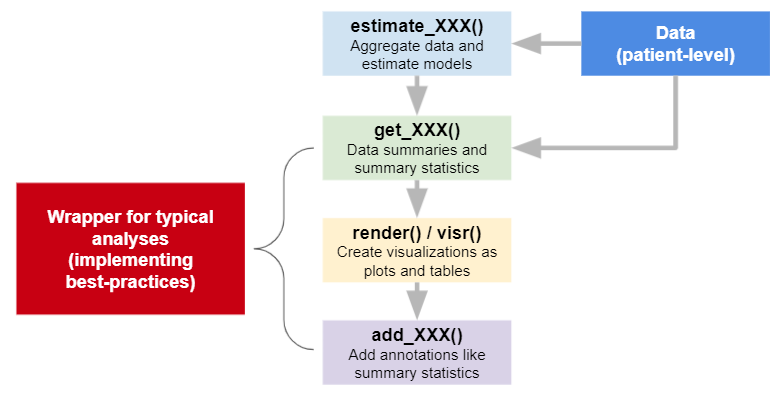
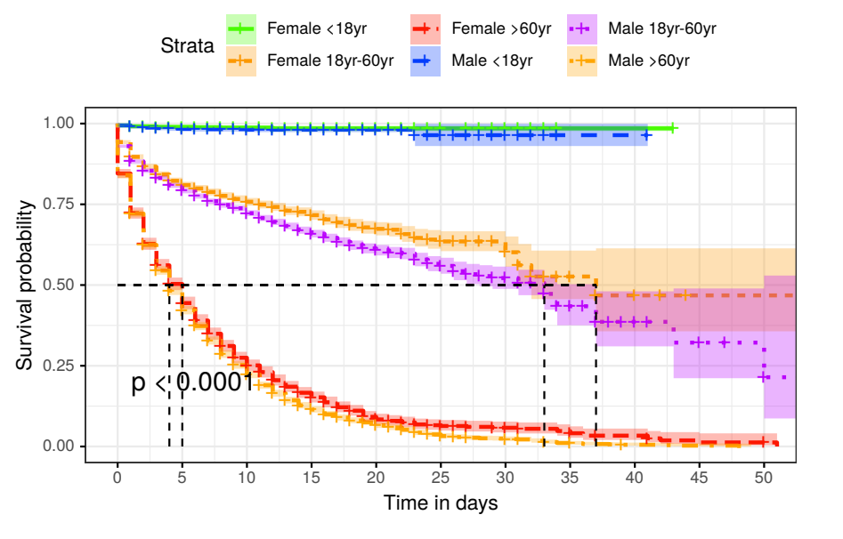

```{r setup, include = FALSE}
library("learnr")
library("visR")
library("ggplot2")
library("dplyr")
tutorial_options(exercise.timelimit = 120)

# Do all the prep work in one chunk as well so we can always reference this one as 
# the "exercise-setup" chunk
data = read.csv("https://raw.githubusercontent.com/vntkumar8/covid-survival/main/data/final.csv")
data$Status = abs(data$Status - 2)
data = data %>%
   dplyr::mutate(
     Age_Cat = recode_factor(Age_Cat,
                             `1` = "<18yr", `2` ="18yr-60yr", `3` = ">60yr"),
     Sex     = as.factor(Sex))
DATASOURCE = "https://github.com/vntkumar8/covid-survival"
TITLE = "Indian Covid Data"
mod = data %>% estimate_KM(strata = "Sex", CNSR = "Status", AVAL = "Stay")

assign("data",       data,       envir = globalenv())
assign("DATASOURCE", DATASOURCE, envir = globalenv())
assign("TITLE",      TITLE,      envir = globalenv())
assign("mod",        mod,        envir = globalenv())

theme_set(theme_bw())

```

## Welcome

### visR - A package for Effective Visualizations in Pharma

This tutorial will introduce you to the basic usage of [`visR`](https://openpharma.github.io/visR/), an R package for effective visual communication. The package presents an easy-to-use interface for visualizations relevant to the clinical development process, implementing several best practices. It was developed as part of the [`openpharma`](https://openpharma.github.io/#manifesto) initiative, an effort for open-source cross-industry collaboration.


### Further reading
* The graphical principles that [`visR`](https://openpharma.github.io/visR/) aims to implement [[graphicsprinciples.github.io](https://graphicsprinciples.github.io/)]
* visR Documentation [[openpharma.github.io/visR](https://openpharma.github.io/visR/)]
* visR @ GitHub [[github.com/openpharma/visR](https://github.com/openpharma/visR)]
* visR @ CRAN [[cran.r-project.org/web/packages/visR](https://cran.r-project.org/web/packages/visR/index.html)]
* openpharma overview [[openpharma.github.io](https://openpharma.github.io/)]


## Package architecture

The [`visR`](https://openpharma.github.io/visR/) package implements a simple-to-use interface by adhering to consistent naming conventions. 

### Overview



In principle, `extimate_XXX` functions allow to estimate statistical models from the data (e.g. `estimate_KM` estimates a survival model), `get_XXX` functions get all kinds of summary statistics (e.g. `get_tableone` or `get_pvalue`), `render` and `visr` display plots and tables, and `add_XXX` functions add specific information to a plot or table (e.g. `add_CI` adds confidence intervals to a plot.)

### Example

{width=90%}

### Outline
This tutorial will walk you through a basic survival analysis show-casing some principles and features of [`visR`](https://openpharma.github.io/visR/).

1. We will start off by introducing a data set provided by the [`COVID-19 India Org Data Operations Group`](https://api.covid19india.org/) that we will use throughout the tutorial.
2. Then we will introduce a so-called `table 1` which gives an overview of the patient population.
3. We will `estimate_` a survival model and introduce functions to `get_` summary statistics.
4. We will plot the survival model and show how you can `add_` additional information to it.
5. We will integrate summary statistics into the plots.

## The study and the data

**Risk and Survival Analysis from COVID Outbreak Data :Lessons from India**

The goal of this paper was to assess the mortality in India due to COVID-19. To understand the survival of COVID-19 patients, a time-to-event analysis was performed based on Kaplan-Meier estimates using gender and age group (separately and combined) as strata. According to the authors ([Bankar et al., 2021](https://proceedings.mlr.press/v146/bankar21a.html)), this was probably the biggest retrospective-cohort survival analysis conducted in India, according to the authors. This paper used publicly available data [`COVID-19 India Org Data Operations Group`](https://api.covid19india.org/).

The below figure roughly described trends and distributions of the patient population. 
```{r describe-data, echo = FALSE, fig.width = 9, warning = FALSE}

sex_age_cat_levels = c("M (>60yr)", "M (18yr-60yr)", "M (<18yr)", "F (>60yr)", "F (18yr-60yr)", "F (<18yr)")

data = data %>%
  dplyr::mutate("Sex_Age_Cat" = paste0(Sex, " (", Age_Cat, ")")) %>%
  dplyr::mutate(Sex_Age_Cat = factor(Sex_Age_Cat, levels = sex_age_cat_levels))

barplot_df = table(data$Sex_Age_Cat) %>% as.data.frame()
barplot_df = barplot_df[c(5, 6, 4, 2, 3, 1),]
barplot_df = barplot_df %>%
  dplyr::mutate(Var1 = factor(Var1, levels = sex_age_cat_levels))
rownames(barplot_df) = NULL

age_sex_barplot = barplot_df %>%
  ggplot2::ggplot(ggplot2::aes(y = Var1, 
                               x = Freq, 
                               fill = as.factor(Var1), 
                               colour = as.factor(Var1))) + 
    ggplot2::geom_bar(stat = "identity") +
    ggplot2::geom_text(ggplot2::aes(label = Freq), 
                       hjust = -0.2, 
                       colour = "black") +
    ggplot2::xlim(c(0, 15000)) + 
    ggplot2::ylab("") + 
    ggplot2::xlab("Count") + 
    ggplot2::scale_fill_brewer(palette = "Set2") +
    ggplot2::scale_colour_brewer(palette = "Set2") +
    ggplot2::theme(legend.position = "bottom") +
    ggplot2::theme(legend.title = ggplot2::element_blank())

stay_densityplot = data %>%
  ggplot2::ggplot(ggplot2::aes(x = Stay, 
                               colour = as.factor(Sex_Age_Cat))) +
    ggplot2::geom_density(alpha = 0.3) + 
    ggplot2::scale_fill_brewer(palette = "Set2") +
    ggplot2::scale_colour_brewer(palette = "Set2") +
    ggplot2::xlab("Length of hospital stay (days)") + 
    ggplot2::theme(legend.position = "bottom") +
    ggplot2::theme(legend.title = ggplot2::element_blank())

age_stay_scatterplot = data %>%
  ggplot2::ggplot(ggplot2::aes(x = Age,
                               y = Stay)) + 
    ggplot2::geom_bin2d() +
    ggplot2::ylab("Length of hospital stay (days)") + 
    ggplot2::xlab("Age (years)") + 
    ggplot2::scale_fill_continuous(type = "viridis")

ggpubr::ggarrange(age_sex_barplot, 
                  stay_densityplot, 
                  age_stay_scatterplot,
                  ncol = 3,
                  common.legend = TRUE)

```


### The data

Patients who were admitted to Karnakata, South India, were recruited. The final dataset consists of 26,741 patients. Age and gender of the patient, the number of days in the hospital per stay, the status of the patient (1=censored/alive, 2=dead) and the age category (\<18 yr, 18 yr -- 60 yr, \>60 yr) were collected.

-   [[Publication](http://proceedings.mlr.press/v146/bankar21a.html)]

-   [[GitHub](https://github.com/vntkumar8/covid-survival)]

-   [[Raw data](https://raw.githubusercontent.com/vntkumar8/covid-survival/main/data/final.csv)]

```{r load-data, exercise = TRUE, exercise.eval = TRUE, exercise.startover = FALSE	}

# First, we set the default ggplot2 theme
theme_set(theme_bw())

# Then, we directly load the data from their GitHub repository
data = read.csv("https://raw.githubusercontent.com/vntkumar8/covid-survival/main/data/final.csv")

data

```

### Preparing the data

For the analysis, slight modifications will need to be implemented to the data. Since [`visR`](https://openpharma.github.io/visR/) was developed with the goal to speed up the clinical development process, it follows the [`cdisc ADaM`](https://www.cdisc.org/standards/foundational/adam) standards. Additionally, some of the functions are data-type sensitive and give more informative summaries when the proper data-type is present.

The following changes are necessary:

1. As per ADaM guidelines, an event is indicated as `0` while censoring is indicated as `>0`. In the data that we will use, `2` stands for the event while `1` stands for censoring. Therefore, the censoring values have to be adjusted.

2.  The column `Age_Cat` will be parsed as a `integer` while `Sex` will be `character`. Converting them to `factor` will result in more informative output. Furthermore, `Age_Cat` is encoded as a numerical value between 1-3. By adding the respective names to these categories, the output will be more readable.

```{r prepare-data, exercise = TRUE, exercise.setup = "load-data", exercise.startover = FALSE, exercise.eval = FALSE}

# 1. Adjust censoring
data$Status = abs(data$Status - 2)

# 2. Convert to factors and add the age categories
data = data %>%
   dplyr::mutate(
     Age_Cat = recode_factor(Age_Cat,
                             `1` = "<18yr", `2` ="18yr-60yr", `3` = ">60yr"),
     Sex     = as.factor(Sex))

data
```


### Live Demo


```{r live-demo, exercise = TRUE, exercise.setup = "setup", exercise.startover = FALSE, exercise.eval = FALSE, exercise.lines = 30, fig.width=9}
# Live demo
```

## Generation of summary tables

A typical clinical report contains a demography table, detailing the distribution of patients across different arms of the clinical trial. Commonly reported variables are age, sex and baseline disease characteristics. This table is sometimes referred to as Table 1.

`visR` provides a set of functions to both generate and render tables. When rendering, `visR` enforces the specification of a data source and a title. These functions are demonstrated demonstrated below. By default, the table is generated for the whole population but a stratifier can be defined.


```{r basic-tableone, exercise=TRUE, exercise.setup = "setup", exercise.startover=FALSE, exercise.eval=FALSE}

# Define meta-data
DATASOURCE = "https://github.com/vntkumar8/covid-survival"
TITLE = "Indian Covid Data"

data %>% tableone(title = TITLE, datasource = DATASOURCE)
```

**Exercise 1**: Generate the table using `Sex` as the stratifier.

**Exercise 2**: Generate the table using `Sex` and `Age_Cat` as the stratifier.

**Exercise 3**: Add an additional `footnote` to the table.

```{r survival-plot-exercise-1, exercise=TRUE, exercise.setup = "setup", exercise.startover=FALSE, exercise.eval=FALSE}

# Have fun!

```


### Note

You will notice that the the above tables will contain `NA`s for the stratifier they have been split on. A workaround for this is to first `get` the table 1 as a data.frame, then remove these stratifier, and then render it. This examples demonstrates the modular built and compatibility of visR. The `tableone` command was actually a wrapper around the functions `get_tableone` which builds a `data.frame` with summary statistics and the `render` command which displays it nicely.


```{r fixed-tableone, exercise=TRUE, exercise.setup = "setup", exercise.startover=FALSE, exercise.eval=FALSE}

data %>% 
  get_tableone(strata = c("Sex", "Age_Cat")) %>% 
  filter(variable != "Sex" & variable != "Age_Cat") %>% 
  render(title = TITLE, datasource = DATASOURCE)
```

(This will be fixed in the upcoming release.)


## Fitting survival models 

As mentioned, [`visR`](https://openpharma.github.io/visR/) has defaults following the CDISC ADaM standard. If your data set uses these as well, estimating and plotting survival curves is particularly straightforward.

```{r cdisc-survival, exercise=TRUE, exercise.setup = "setup", exercise.startover=FALSE, exercise.eval=FALSE}

# The dataset that comes with visR is cdisc ADaM compliant 
mod = visR::adtte %>% estimate_KM() 

# When no strata is specified, the overall patient cohort is analysed
mod

mod %>% visr()

```

### Survival analysis of the Indian COVID data

Since ADaM standards are not utilized beyond clinical trial analysis and reporting,, the functions in [`visR`](https://openpharma.github.io/visR/) have parameters allowing for specification of the respective column names without modifying the actual data.

```{r indian-survival, exercise=TRUE, exercise.setup = "setup", exercise.startover=FALSE, exercise.eval=FALSE}

mod = data %>% estimate_KM(strata = "Sex", CNSR = "Status", AVAL = "Stay")
mod
```

Once the model is estimated, different summary statistics are easy to `get_`

```{r get_pvalue, exercise=TRUE, exercise.setup = "setup", exercise.startover=FALSE, exercise.eval=FALSE}

mod %>% get_pvalue()

```

**Exercise 1**: Calculate the quantiles for the model.

```{r survival-plot-exercise_1, exercise=TRUE, exercise.setup = "setup", exercise.startover=FALSE, exercise.eval=FALSE}

# Have fun!

```


## Plotting survival models

These survival models can easily be plotted using [`visR`](https://openpharma.github.io/visR/).

```{r basic-survival-plot, exercise=TRUE, exercise.setup = "setup", exercise.startover=FALSE, exercise.eval=FALSE}

mod %>% visr()

```

The [`visR`](https://openpharma.github.io/visR/) function provides several convenient functions to adjust the aesthetics of the plot.

```{r basic-survival-plot-options, exercise=TRUE, exercise.setup = "setup", exercise.startover=FALSE, exercise.eval=FALSE}

mod %>%
  visr(legend_position = "top",
       x_label = "")
mod %>%
  visr(legend_position = "top",
       x_units = "years")
mod %>%
  visr(legend_position = "top",
       fun = "log")

```

**Exercise 1**: Change the stratifier in the survival model to `Age_Cat`.

**Exercise 2**: Plot the new model.

```{r survival-plot-exercise-3, exercise=TRUE, exercise.setup = "setup", exercise.startover=FALSE, exercise.eval=FALSE}

# Have fun!

```


### Improving survival plots

On top this, [`visR`](https://openpharma.github.io/visR/) provides several functions to further improve plots. It is, for example, easy to add confidence intervals or censoring markers.

```{r survival-plot-add-x, exercise=TRUE, exercise.setup = "setup", exercise.startover=FALSE, exercise.eval=FALSE}

mod %>%
  visr() %>%
  add_CI()

```

**Exercise 1**: Add markers for censoring. (Hint: functions adding statistics to a plot in [`visR`](https://openpharma.github.io/visR/) usually start with `add_`).

```{r survival-plot-exercise-4, exercise=TRUE, exercise.setup = "setup", exercise.startover=FALSE, exercise.eval=FALSE}

# Have fun!

```


Also, a function is provided to further annotate the plot with additional information.

```{r survival-plot-annotate-basic, exercise=TRUE, exercise.setup = "setup", exercise.startover=FALSE, exercise.eval=FALSE}

mod %>%
  visr() %>%
  visR::add_annotation(label = "Hello world", xmin = 0, ymin = 0.5)

```

**Exercise 1**: Add information about statistical significance tests to a survival plot. (Hint: Combine `add_annotation()` and `get_pvalue()`).

```{r survival-plot-exercise-5, exercise=TRUE, exercise.setup = "setup", exercise.startover=FALSE, exercise.eval=FALSE}

# Have fun!

```


### Styling

Particular attention was paid to stay compatible with the `ggplot2` ecosystem. Therefore, the created objects can for example be styled like any other `ggplot`.

```{r survival-plot-style, exercise=TRUE, exercise.setup = "setup", exercise.startover=FALSE, exercise.eval=FALSE}

gg = mod %>% visr() 
  
gg + ggplot2::theme_dark()

```


**Exercise 1**: Try to recreate the Figure 5 of the [Indian Covid data publication](http://proceedings.mlr.press/v146/bankar21a.html) as close as possible using what you learned until now. Alternatively, you can create a more visually pleasing variant.




```{r survival-plot-exercise-6, exercise=TRUE, exercise.setup = "setup", exercise.startover=FALSE, exercise.eval=FALSE}

# Have fun!

```

## Combining plots with summary statistics

Another good practice is to provide summary statistics that accompany the survival plot. For this purpose, [`visR`](https://openpharma.github.io/visR/) provides a handy function that can be appended to the normal piping framework.

**NOTE**: This breaks compatibility with the `ggplot2` functions. Therefore, styling has to happen before adding the risktable.

```{r survival-plot-risktable, exercise=TRUE, exercise.setup = "setup", exercise.startover=FALSE, exercise.eval=FALSE, fig.height = 7}

mod %>%
  visr() %>%
  add_risktable(statlist = c("n.risk", "n.event", "n.censor"))

```

Analogous to the functions creating and showing a Table 1, risktables can also be generated independently (using a `get_` function) and can then be rendered.

**Exercise 1**: Create and render a risktable from the survival model

```{r survival-plot-exercise-7, exercise=TRUE, exercise.setup = "setup", exercise.startover=FALSE, exercise.eval=FALSE}

# Have fun!

```


## Advanced usage

Here we demonstrate some advanced options that might be useful for some cases.


### Attrition

Often only subgroups of the population are analysed and complete data sets need to be filtered according to specific criteria. The function `get_attrition` allows to list filter statements explanations, which can be visualized as a table (with `render`) or be plotted (with `visr`). The function `apply_attrition` then filters a `data.frame`.

```{r basic-attrition, exercise=TRUE, exercise.setup = "setup", exercise.startover=FALSE, exercise.eval=FALSE}

data$Patient = 1:nrow(data) 

condition = "Age_Cat != '<18yr'"

filters = data %>% get_attrition(subject_column_name = "Patient", 
                                 criteria_descriptions = "18 and older", 
                                 criteria_conditions = condition) 

filters %>% visr()

filters %>% render(title = "Attrition Table", datasource = DATASOURCE)

data %>% apply_attrition(condition)


```


### Custom summary functions for the Table 1

The tableone function accepts custom functions to be run on the columns. For this purpose, the different possible data-type have to be considered. For simplicity, only the behaviour for the numeric columns will be changed in the example below.

```{r custom-func-tableone, exercise=TRUE, exercise.setup = "setup", exercise.startover=FALSE, exercise.eval=FALSE, exercise.lines=35}

# This is basically the default function but doesn't return the missing values.
my_func = function(x) {
  
  if (is.numeric(x)) {
  
    dat = list(
      `Mean (SD)` = paste0(format(mean(x, na.rm = TRUE), digits = 3), 
                           " (", 
                           format(sd(x, na.rm = TRUE), digits = 3), 
                           ")"),
      `Median (IQR)` = paste0(format(median(x, na.rm = TRUE), digits = 3), 
                              " (", 
                              format(quantile(x, probs=0.25, na.rm = TRUE), digits = 3),
                              "-", 
                              format(quantile(x, probs=0.75, na.rm = TRUE), digits = 3), 
                              ")"),
      `Min-max` = paste0(format(min(x, na.rm = TRUE), digits = 3), 
                         "-", format(max(x, na.rm = TRUE), digits = 3))
    )
    
    list(dat)
    
  } else {
    
    visR::summarize_short(x)
    
  }
}

data %>% 
  get_tableone(strata = c("Sex", "Age_Cat"), summary_function = my_func) %>% 
  filter(variable != "Sex" & variable != "Age_Cat") %>% 
  render(title = TITLE, datasource = DATASOURCE)
```

### Different rendering engines for table output

As default, the tables will be rendered with `gt`. However, other options like for example `kable` or `dt` are also implemented.

```{r rendering-engines-dt, exercise=TRUE, exercise.setup = "setup", exercise.startover=FALSE, exercise.eval=FALSE}

mod %>% 
  get_pvalue() %>% 
  render(title = TITLE, 
         datasource = DATASOURCE, 
         engine = "kable") # dt launches a child process which crashes on shinyapps.io? 

```

### Possible solution to the exercise for recreating figure 5

```{r solution-figure5, exercise=TRUE, exercise.setup = "setup", exercise.startover=FALSE, exercise.eval=FALSE}

m = data %>% estimate_KM(strata = c("Sex", "Age_Cat"),
                         CNSR = "Status", 
                         AVAL = "Stay")

half_surv_df = m %>% 
  get_quantile(probs = 0.5) %>% 
  dplyr::filter(quantity == "quantile") %>%
  dplyr::mutate(pos1 = `50`, pos2 = 0.5) %>%
  dplyr::select(-c(quantity, `50`))
  
half_surv_df_horizontal = half_surv_df %>% dplyr::mutate(pos1 = 0)
  
half_surv_df_vertical = half_surv_df %>% dplyr::mutate(pos2 = 0)
  
half_surv_df = rbind(half_surv_df, half_surv_df_horizontal, half_surv_df_vertical)  
  
m %>%
  visr() %>%
  add_CI() %>%
  add_CNSR() +
  ggplot2::geom_line(data = half_surv_df, ggplot2::aes(pos1, pos2, group = strata), linetype = "dashed")

```
